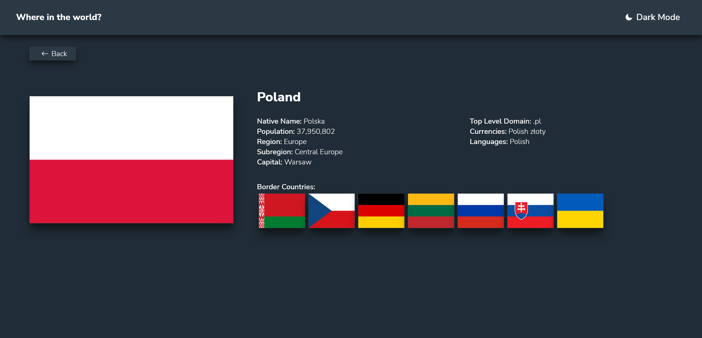

# Frontend Mentor - REST Countries API with color theme switcher

This is a solution to the [REST Countries API with color theme switcher on Frontend Mentor](https://www.frontendmentor.io/challenges/rest-countries-api-with-color-theme-switcher-5cacc469fec04111f7b848ca/hub). Frontend Mentor challenges help you improve your coding skills by building realistic projects.

## Table of contents

- [Overview](#overview)
  - [The challenge](#the-challenge)
  - [Screenshot](#screenshot)
  - [Links](#links)
- [My process](#my-process)
  - [Built with](#built-with)
  - [What I learned](#what-i-learned)
- [Author](#author)

**Note: Delete this note and update the table of contents based on what sections you keep.**

## Overview

### The challenge

Users should be able to:

Challenges from creators:

- See all countries from the API on the homepage
- Search for a country using an input field
- Filter countries by region
- Click on a country to see more detailed information on a separate page
- Click through to the border countries on the detail page
- Toggle the color scheme between light and dark mode

I also added several features by myself:

- I display all the flags of neighboring countries, when you click on which one you go to the country in question
- Display spinners and skeleton animation if data fetching has not finished
- Error handling, 404 page, errors, or if a user enters data into the search engine that does not coincide with any country

### Screenshot

### Links

- Live Site URL: [https://dawidbugajski.github.io/rest-countries-api/](https://dawidbugajski.github.io/rest-countries-api/)

## My process

### Built with

- [React](https://reactjs.org/) - JS library
- [React Query](https://tanstack.com/query/latest/docs/react/overview/) - A library used to manage data
- [React Router](https://reactrouter.com/en/main) - A library used to navigate React applications.
- [MaterialUI](https://mui.com/material-ui/getting-started/overview/) - React library using for components like dropdown
- [Tailwindcss](https://tailwindcss.com/) - Tailwindcss

### What I learned

In the project I practiced I learned among other things :

- Planning and storage of the entire application state in one place with context API
- Working with react query
- Creating reusable components, separating logic from UI
- Doing routing with react router
- Code refactore
- Handling errors, taking care of displaying components for 404, etc.

## Author

- Github - [DawidBugajski](https://github.com/DawidBugajski)
- Linkedin - [DawidBugajski](https://www.linkedin.com/in/dawid-bugajski-1bb01519b/)
